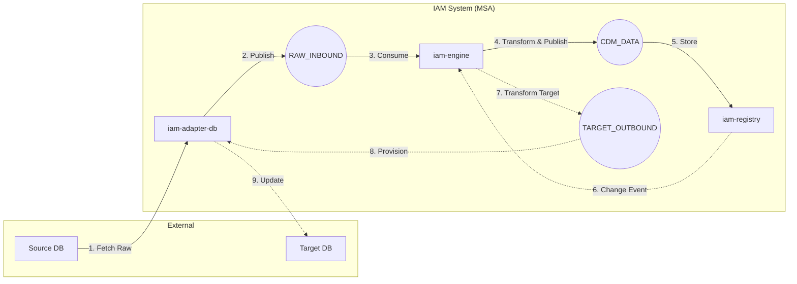

# 📜 IAM MVP 기술 명세서 (Version 2.0 - MSA Based)

## 1. MVP 목표: "HR 데이터 수집 및 SCIM 2.0 규격 변환 -> IAM 내부 사용자 생성(Core/Extension 분리) -> 식별자 매핑 -> 대상 시스템 프로비저닝"

## 2. 시스템 아키텍처 및 데이터 흐름

SCIM 2.0 프로토콜을 기반으로 외부 시스템(HR)으로부터 데이터를 수신하여 IAM Registry에 저장하고, 대상 시스템(AD)으로 프로비저닝합니다.
기존 모놀리식 구조의 한계를 극복하기 위해 Event Choreography (RabbitMQ) 기반의 마이크로서비스 아키텍처(MSA)로 리팩토링되었습니다.

### 핵심 마이크로서비스 (Microservices)

1. **`iam-eureka` (Service Discovery):**
   * 전체 MSA 모듈들의 상태를 모니터링하고 동적으로 위치를 찾을 수 있게 해주는 카탈로그(전화번호부) 역할을 수행합니다.
2. **`iam-adapter-db` (Connectivity Adapter):**
   * 외부 시스템(HR/AD 원천 DB)과의 순수한 DB 통신만 담당합니다.
   * 비즈니스 로직(변환 규칙)을 알지 못하며, 조회한 원천 데이터를 RabbitMQ(`RAW_INBOUND_DATA`)로 쏘거나, 엔진으로부터 받은 데이터(`TARGET_OUTBOUND_DATA`)를 타겟 DB에 반영하기만 합니다.
3. **`iam-engine` (Transformation Engine):**
   * 시스템의 심장이자 변환 로직 전담 모듈입니다. (Groovy 4.x 기반)
   * `RAW_INBOUND_DATA` 큐를 읽어 Groovy Script를 통해 표준 구조로 변환 후 `CDM_DATA_QUEUE` 큐로 발행합니다.
   * `SecureASTCustomizer`를 통해 격리된 샌드박싱 환경에서 매핑 규칙을 안전하게 실행합니다.
4. **`iam-registry` (Identity Registry):**
   * 최종 데이터(Golden Record)의 영속성을 보장하는 핵심 저장소입니다. (PostgreSQL, Hibernate)
   * `CDM_DATA_QUEUE`를 읽어 데이터를 영속화하고 이력을 기록합니다.
   * SCIM 2.0 규격 준수 REST API (사용자, 스키마, 메타데이터 조회/수정)를 제공합니다.

### 데이터 흐름 (Event Choreography)



## 3. 데이터 모델 전략 (Hybrid Storage)

상세 구현은 `iam-registry` 모듈의 엔티티 클래스를 참조하십시오.

* **Core Attributes (정형):** 검색, 필터링에 빈번하게 사용되는 속성 (`IamUser`).
  * 주요 필드: `userName`, `externalId`, `active`, `name` (Flattened).
* **Extension Attributes (비정형):** 가변성이 높고 시스템별로 상이한 확장 속성 (`IamUserExtension`).
  * 저장 방식: PostgreSQL **JSONB**를 사용하여 스키마 드래프트 없이 유연하게 대응.
* **동적 리소스 저장소 (ScimDynamicResource):** 런타임에 정의된 새로운 리소스 타입을 위한 범용 저장소.

## 4. 데이터 연동 엔진 (Rule Engine)

런타임에 동적으로 데이터 변환 로직을 처리하며, 모든 이력은 추적 가능해야 합니다.

* **변환 패턴 및 규칙 매핑:**
  * `DIRECT`: 1:1 단순 필드 배핑.
  * `CODE`: 내부 DB 규칙 리스트 참조 후 치환 (없으면 Pass-through 방침).
  * `CLASSIFY` / `REPLACE`: 키워드 조작 치환.
  * `CUSTOM`: 자유도가 높은 순수 커스텀 Groovy 코드(Snippet) 실행.

## 5. 이력 관리 및 데이터 추적성 (Traceability)

IAM 시스템은 데이터의 원천 유입 -> 변환 -> 최종 저장소를 모두 연결해 추적(`traceId`) 가능케 합니다.

### 5.1 시스템 동기화 장부 (Sync History)

* **내용:** 원본 데이터 변화 이력, 처리 수행 시간, 동기화 방향 명시 (`SYNC`, `INTEGRATION_SYNC`, `AUDIT`).
* **데이터 최적화:** 원천 이벤트 전체를 `request_payload` (JSONB)로 보관하여 문맥을 유지합니다. 실제 변경된 값들만 `result_data` (JSONB)에 기록합니다.

### 5.2 데이터 스냅샷 및 복원 (Audit Snapshot)

* Hibernate Envers `@Audited`를 통해 기록되며, `CustomRevisionEntity`를 통해 Revision ID에 `traceId`를 삽입하여 특정 변환 파이프라인 시점의 엔티티 모델 전체를 재구축할 수 있습니다.

---

## 6. API Specification (REST & SCIM 2.0)

이 문서는 `iam-registry`에서 서비스하는 API 명세를 정의합니다. 모든 응답 데이터 포맷은 JSON을 사용합니다.

### 6.1 공통 응답 구조 (Error Response)

에러 발생 시 다음과 같은 공통 구조로 응답합니다.

```typescript
interface ErrorResponse {
  errorCode: string;    // 내부 에러 코드 (ex: IAM-4103)
  message: string;      // 사용자 친화적 메시지
  traceId: string;      // 로그 추적용 ID
  timestamp: string;    // 발생 시각
  path: string;         // 요청 경로
  status: number;       // HTTP 상태 코드
}
```

### 6.2 SCIM User API

* **사용자 상세 조회 (현재 시점):** `GET /scim/v2/Users/{id}`
* **사용자 상태 이력 조회 (Revision 기반):** `GET /api/v1/history/users/{id}/revisions/{revId}`
* **사용자 상태 이력 복구 (Trace ID 기반):** `GET /api/v1/history/users/{id}/trace_id/{traceId}`

### 6.3 History API

* **동기화 이력 (장부) 전체 조회:** `GET /api/v1/history` (필터: `userId`, `targetUser`, Paged)
* **특정 사용자 리비전(스냅샷) 목록 조회:** `GET /api/v1/history/users` (필터: `userId`, `traceId`)

### 6.4 Rule Engine Mapping History API

* **필드 매핑 현재 내역 조회:** `GET /api/v1/rules/{ruleId}/mappings`
* **시스템별 과거 필드 매핑 룰 복원 조회:** `GET /api/v1/rules/history?systemId={id}&revId={revId}`

### 6.5 Dynamic SCIM API (Experimental)

런타임에 등록된 동적 리소스 타입에 대한 CRUD를 지원합니다.

* **리소스 목록/상세 조회:** `GET /scim/v2/{ResourceType}` & `/{id}`
* **리소스 생성:** `POST /scim/v2/{ResourceType}`
* **리소스 수정:** `PUT /scim/v2/{ResourceType}/{id}`
* **리소스 삭제:** `DELETE /scim/v2/{ResourceType}/{id}`

### 6.6 SCIM Metadata Discovery API

* **스키마 목록 및 상세 조회:** `GET /scim/v2/Schemas` & `/{uri}`
* **지원 패키지(ResourceType) 목록 조회:** `GET /scim/v2/ResourceTypes`

### 6.7 Admin API (Schema & Attribute Rules)

* **도메인(USER/GROUP)별 속성 메타데이터 조회:** `GET /api/attributes?domain={domain}`
* **속성 메타데이터 및 스키마 변경 (POST, PUT, DELETE):** 제공 (단, CORE 속성은 삭제 불가)
