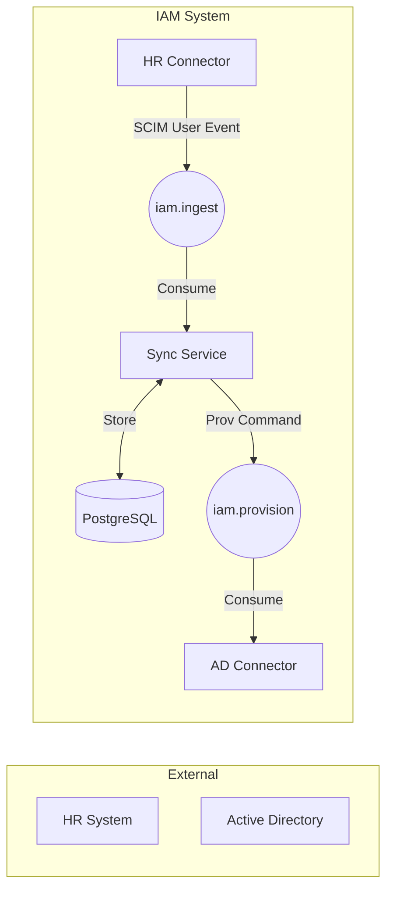

# 📜 IAM MVP 기술 명세서 (Version 1.3 - Reference Based)

## 1. MVP 목표: "HR 데이터 수집 및 SCIM 2.0 규격 변환 -> IAM 내부 사용자 생성(Core/Extension 분리) -> 식별자 매핑 -> 대상 시스템 프로비저닝"

## 2. 시스템 아키텍처 및 데이터 흐름

SCIM 2.0 프로토콜을 기반으로 외부 시스템(HR)으로부터 데이터를 수신하여 IAM Core에 저장하고, 대상 시스템(AD)으로 프로비저닝합니다.

* **Ingestion:** HR Connector가 원천 데이터를 SCIM User Resource 형태로 변환하여 전송합니다.
* **Core Storage:** 정형 속성(Core)은 컬럼으로, 비정형 속성(Extensions)은 JSONB로 분리 저장하는 하이브리드 방식을 채택합니다.

## 3. 데이터 모델 전략 (Hybrid Storage)

상세 구현은 iam-core 모듈의 엔티티 클래스를 참조하십시오.

* **Core Attributes (정형):** 검색, 필터링, 권한 제어에 빈번하게 사용되는 속성.
  * **참조 파일:** `IamUser.java`
  * **주요 필드:** `userName`, `externalId`, `active`, `name` (Flattened).

* **Extension Attributes (비정형):** 가변성이 높고 시스템별로 상이한 확장 속성.
  * **참조 파일:** `IamUserExtension.java`, `ExtensionData.java`
  * **저장 방식:** PostgreSQL **JSONB**를 사용하여 스키마 드래프트 없이 유연하게 대응.
  * **다형성 처리:** `EnterpriseUserExtension.java` 등 URN 기반 다형성 매핑 적용.

* **식별자 매핑:** 외부 시스템과 IAM 간의 ID 매핑 정보를 관리합니다.

## 4. 데이터 연동 엔진 (Rule Engine)

런타임에 동적으로 데이터 변환 로직을 처리하며, 모든 이력은 추적 가능해야 합니다.

* **동적 변환:** Groovy 스크립트를 사용하여 시스템별 매핑 룰 실행.
  * **보안:** `SecureASTCustomizer`를 통한 화이트리스트 기반 샌드박스 실행.

* **이력 관리 (Traceability):**
  * **참조 파일:** `SyncHistory.java`
  * **핵심 규칙:** 모든 이벤트는 `traceId`를 공유하며 `HR -> Core -> AD` 전체 흐름이 연결되어야 함.

* **데이터베이스:** `IAM_TRANS_RULE_META`, `IAM_TRANS_RULE_VERSION` 등 규칙 버전 관리 테이블 참조 (`schema.sql`).

## 5. 개발 가이드 (AI 참조용)

* **Primary Key:** 모든 주요 테이블은 **TSID** (Time-Sorted Unique Identifier)를 사용합니다.
* **Validation:** `userName` 및 `externalId`에 유니크 제약 조건을 보장합니다.
* **Consistency:** 코드 수정 시 반드시 이 문서의 아키텍처 방향성을 유지하고, 구현 결과는 다시 이 문서의 '구현 현황' 섹션에 업데이트합니다.

## 6. 구현 현황 (Status)

[x] Core/Extension 하이브리드 스토리지 설계
[x] TSID 기반 엔티티 구조 설계
[ ] Groovy Rule Engine 샌드박스 구현
[ ] HR Connector SCIM 변환 로직
